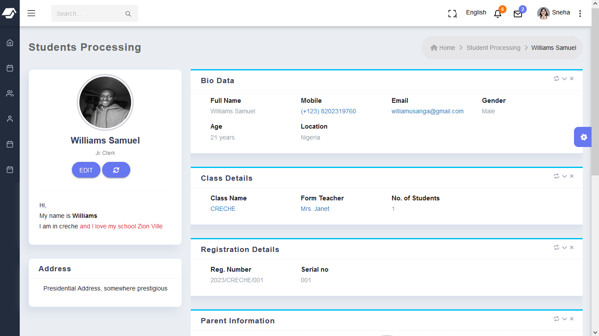
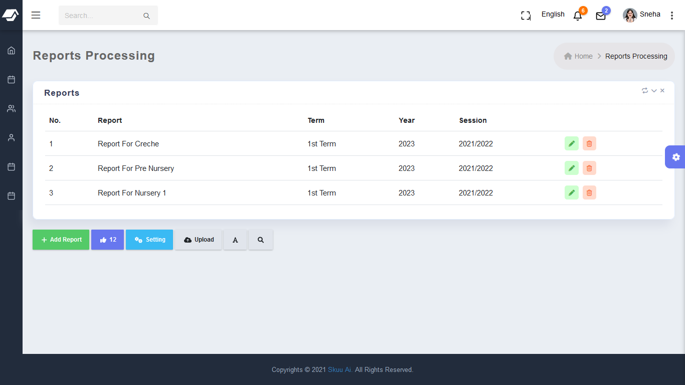
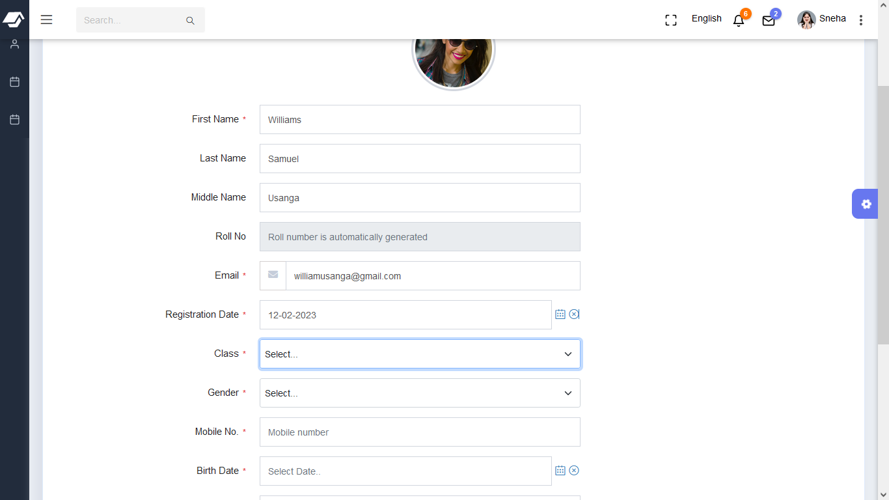

# sms (School Management System )

## About

This project aims to **digitalize** the school ecosystem allowing collection and manipulation of data in any school environment seemless.

The purpose of a school system is to automate school operations. It focuses more on critical learning and teaching processes. A school app can help you track student progress for instance, and manage attendance and fee payments, store and retrieve academic documents, etc.

It is the best platform to make quick interactions with teachers, students, and parents. A school management software promotes a healthy learning atmosphere. Reward and guide all your students equally on time with the app. It also reduces human errors since it generates report cards, mark sheets, etc., automatically.

## Reasons to adopt a school management system
 * ### Attendance management
    An attendance management system is a critical aspect that underlines the importance of school automation software. Attendance marking is time-consuming, tiresome, and less accurate to manage attendance using pen and paper.  It enables you to prepare reports with different matrices efficiently.  You can send alert parents in case a child is absent from school, for instance
 * ### Fee payments
    A school management software eliminates the hurdles of parents and students standing in long queues for fee payments. Use the **parents app**, and make quick payments online in a few clicks. It facilitates quick and safe payments without going to the bank or school. It authenticates payment by generating and sending SMS alerts and receipts. The software alerts and notifies parents when a payment is due, as a result, parent do not have to rush for money at the last minute. 
 * ### Exam management
    

    Another crucial feature is exam management. It helps teachers conduct exams effectively. The traditional way of exams has many drawbacks, like printing question papers, preventing them from leaking, reprinting if there is an error, which is costly and time-consuming. School management software helps you resolve all these hurdles and troubles. It allows teachers to conduct numerous assessments like multiple choice questions and theory-type exams. You can also upload and update exam grades and reports to the student ID using school management app.
 * ### Effective communication
    The system can automatically send event notifications and SMS to the parents. Teachers can use the software to instantly message students and parents on school activities. As you know, transparent and timely communication improves the educational standard of the school and reduces risks. Teachers can use the school ERP to send bulk SMS or personal messages to parents. This app eliminates the communication gap between parents and teachers.   
 * ### Organizes student admission
    
    Student admissions is a tiresome process. Eliminate these complexities with a school ERP software. The software helps you manage the admission process effortlessly by automating the operations. All the personal details of students and parents are stored securely in the cloud. The admission team can easily add, edit or delete this data in a few clicks. A school ERP helps you save time as it can process bulk student data in seconds. It eliminates any human errors and redundancies in student records and prevent data loss. 
 * ### Parents can access system
    Parent involvement is a crucial element in student success. School management software keeps parents engaged and updated about their child's progress and activities at the school. Parents can communicate and discuss their child's performance with teachers with the inbuilt features of the software. It will be difficult for working parents to visit schools regularly to know their child's performance. Use the app to send instant notifications to parents and students about events, attendance, exam schedules, payment dues, etc. Parents can access the app from anywhere and track their child's performance anytime.